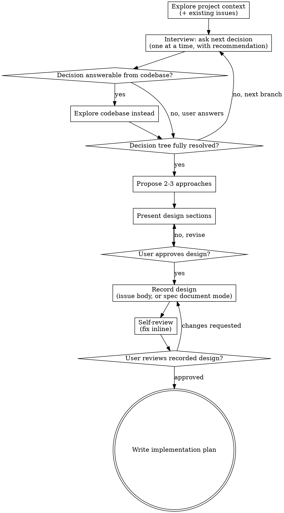

# Blueprint

Turn ideas into fully formed designs through relentless collaborative dialogue, then record the approved design where the team works — a **GitHub issue** by default, or a **committed spec document** when the work calls for one. Either way, every piece of work is tracked by an issue and delivered by a pull request that closes it.

```text
blueprint
  └→ design interview → approved design
       ├→ recorded in the GitHub issue body          (default)
       └→ or committed spec document, linked from the issue
            └→ implementation plan
                 └→ implement skill: branch → gates → PR (Closes #issue)
```

<HARD-GATE>
Do NOT write any code, scaffold any project, or take any implementation action until you have presented a design, the user has approved it, and the design is recorded (issue or spec document). The terminal action of this skill is the implementation plan. This applies to EVERY project regardless of perceived simplicity.
</HARD-GATE>

## Language Rule

All **artifacts** are English: issue title, body, comments, labels, spec files, code, commits, PR. The chat conversation with the user may be in another language, but anything that lands on GitHub or in the repo is English.

## Scale the Process to the Change

Every change — including a one-line fix — gets an issue, an approval, and a PR. **What scales is the depth of the design work, never the existence of the gate.**

| Tier         | Examples                                                           | Process                                                                                                                                                                                                 |
| ------------ | ------------------------------------------------------------------ | ------------------------------------------------------------------------------------------------------------------------------------------------------------------------------------------------------- |
| **Trivial**  | typo, dependency bump, config value, copy change                   | Skip the interview and approaches. Write a 2-4 sentence design (what, why, risk), get one approval, record to the issue, hand off — the design approval doubles as the issue review (checklist step 7). |
| **Standard** | new feature, behavior change, refactor, bugfix with design choices | Full flow below: interview → approaches → design sections → approval.                                                                                                                                   |
| **Large**    | multiple subsystems, platform work                                 | Decompose into sub-issues first; each sub-issue then goes through Standard.                                                                                                                             |

State your tier call and let the user veto it. Misjudged? **Escalate, never downgrade mid-flight:** the moment a "trivial" change sprouts a real decision (interface, data shape, user-visible trade-off), stop and run the Standard flow.

The "too simple to need a design" excuse stays banned — trivial work still gets its 2-4 sentences and an approval. "Simple" changes are where unexamined assumptions cause the most wasted work.

## Checklist

You MUST create a task for each of these items and complete them in order (**Trivial tier:** steps 2-4 collapse into the single short design message):

1. **Explore project context** — check files, docs, recent commits, AND existing issues (`gh issue list`)
2. **Interview the decision tree** — question relentlessly, one question at a time, dependency-ordered, each with a recommended answer, until shared understanding (see Interviewing below)
3. **Propose 2-3 approaches** — with trade-offs and your recommendation
4. **Present design** — in sections scaled to their complexity, get user approval after each section
5. **Record design** — to a GitHub issue by default; spec document mode when the work calls for it (see Recording the Design)
6. **Self-review** — quick inline check for placeholders, contradictions, ambiguity, scope (see below)
7. **User reviews the recorded design** — ask the user to review before proceeding
8. **Transition to implementation** — write the implementation plan; the **implement** skill ships it

## Process Flow



**The terminal state is the implementation plan.** Do NOT jump to writing code, scaffolding, or opening a PR — produce the plan first.

## The Process

**Understanding the idea:**

- Check out the current project state first (files, docs, recent commits)
- Before asking detailed questions, assess scope: if the request describes multiple independent subsystems (e.g., "build a platform with chat, file storage, billing, and analytics"), flag this immediately. Don't spend questions refining details of a project that needs to be decomposed first.
- If the project is too large for a single design, help the user decompose into sub-projects: what are the independent pieces, how do they relate, what order should they be built? Then blueprint the first sub-project through the normal flow. Each sub-project gets its own design → plan → implementation cycle.
- For appropriately-scoped projects, interview the decision tree (below)

**Interviewing: resolve the decision tree:**

Interview the user relentlessly about every aspect of the design until you reach a shared understanding. Don't stop at a handful of questions — walk down each branch of the decision tree, resolving every decision that matters before moving on.

- **Dependency order.** Resolve decisions that other decisions depend on first. Don't ask about button colors before you know whether there's a button.
- **One question per message.** Prefer multiple choice; open-ended is fine.
- **Always recommend.** For every question, give your recommended answer and why. The user should be able to just say "yes" to your recommendation.
- **Explore, don't ask.** If a question can be answered by reading the codebase, recent commits, or existing issues, explore it yourself instead of asking. Only ask what the codebase can't tell you (intent, constraints, preferences, trade-offs).
- **Know when to stop.** The tree is resolved when every branch that affects the design has an answer and no new branches are opening. Then move to approaches.

**Exploring approaches:**

- Propose 2-3 different approaches with trade-offs
- Present options conversationally with your recommendation and reasoning
- Lead with your recommended option and explain why

**Presenting the design:**

- Once you believe you understand what you're building, present the design
- Scale each section to its complexity: a few sentences if straightforward, up to 200-300 words if nuanced
- Ask after each section whether it looks right so far
- Cover: architecture, components, data flow, error handling, testing
- Be ready to go back and clarify if something doesn't make sense

**Design for isolation and clarity:**

- Break the system into smaller units that each have one clear purpose, communicate through well-defined interfaces, and can be understood and tested independently
- For each unit, you should be able to answer: what does it do, how do you use it, and what does it depend on?
- Can someone understand what a unit does without reading its internals? Can you change the internals without breaking consumers? If not, the boundaries need work.

**Working in existing codebases:**

- Explore the current structure before proposing changes. Follow existing patterns.
- Where existing code has problems that affect the work, include targeted improvements as part of the design.
- Don't propose unrelated refactoring. Stay focused on what serves the current goal.

## Recording the Design

### Choose the recording mode

- **Default → the GitHub issue body** (sections below). The issue is where work is discussed, reviewed, and tracked.
- **Spec document mode** → the design lands as a committed file, linked from a tracking issue. Use it when a human developer will implement from the spec, the work is part of a reusable project template, or the user explicitly asks for a design doc. See Spec Document Mode below.
- **Never silently write a local file.** A committed spec happens only through spec document mode with the user aware; otherwise the issue is the single source of truth.

### Preflight

Run `gh auth status` first. If `gh` is missing or unauthenticated, STOP and tell the user — do NOT silently fall back to writing a local file. Ask them to authenticate or confirm an alternative.

### Title convention — discover, don't invent

Before titling the issue, check whether the org enforces a convention: look for an issue-validate workflow in `.github/workflows/` (often a thin caller into an org-level `<org>/.github` hub repo) and read the rule it enforces. When a conventional-style "hybrid" scheme is in force — common shape: `<type>(<scope>): <lowercase description>` with the repo's commitlint type enum — issue titles MUST follow it. No enforced convention found → mirror the repo's commit convention from `git log`; plain descriptive English title as last resort.

### Create vs. comment — ASK, don't guess

- **No relevant issue exists** → create one. Confirm before creating ("No existing issue found — create a new one titled `<X>`?").
- **A relevant issue exists** → comment the design onto it.
- **Never auto-match an issue by title similarity.** If unsure which issue, ask the user for the number.

### Use the repo's issue template

Issue structure comes from the repo's own template, which differs per repo. **Always check `.github/ISSUE_TEMPLATE/` first — when a template exists, using it is MANDATORY.** Never invent your own structure over the repo's template.

- **Template exists** → you MUST use it: read the template file yourself and fill its sections with the agreed design (pick the right one if there are several; map the design onto its sections). If it contains a checklist, fill in what's known and leave the rest for the execution phase. Mechanics only: do NOT pass `--template` to `gh issue create` — it is mutually exclusive with `--body`/`--body-file` and drops into an interactive editor an agent cannot drive. Deliver the filled template via `--body-file` instead; the issue content must follow the template's structure exactly.
- **YAML issue forms** (`*.yml` with a `body:` field list, the modern format) cannot be driven via the CLI at all — parse the form schema yourself and emulate it: each field's `label` becomes a `### <Label>` heading in the body, in form order, required fields always filled (this matches how GitHub renders submitted forms). Respect the form's `title:` pattern and apply its `labels:` with `--label`.
- **No template in the repo** → only then use a plain issue body, and mention to the user once that the repo has no issue template.

Always write the body to a temp file and pass `--body-file` — design bodies contain backticks, quotes, and `$` that break inline `--body` shell quoting.

```sh
# write the filled body (template-based or plain) to a temp file first, then:
gh issue create --title "<concise English title>" --body-file /tmp/issue-body.md
# or comment the design onto an existing issue
gh issue comment <n> --body-file /tmp/design-comment.md
```

### Labels, assignees, reviewers, sub-issues

- **Label by scope** — apply the labels that match the work's area/size. Only pass `--label` for labels that already exist (check `gh label list`); to add a new label, ask the user first — never create labels unprompted in a shared repo.
- **Invite the relevant people** — assign/mention those who should read what's planned (`--assignee`, or `@mention` in the body). Determine who from CODEOWNERS or by asking the user — never guess.
- **Discussion lives in comments** — every change request and conversation happens in the issue thread; revisions are appended comments, never body overwrites.
- **Sub-issues** — when the scope is large, split it into sub-issues (one shippable piece each) and link them from the parent body as a task list (`- [ ] #<n>`). Each sub-issue gets its own branch and PR later.
- **Amendments vs. restructure** — appended amendment comments are for refining the design _before approval_. Re-estimate the delivery after each amendment: the moment accumulated scope would exceed one reviewable PR (~400 changed lines), STOP amending and restructure — convert the issue into a tracking epic with a sub-issue task list, one shippable piece each, ordered by what unblocks what (e.g., tooling that validates commits lands first). Restructure happens BEFORE implementation starts, never after PRs are open.

### Self-Review

After recording the design, re-read it with fresh eyes:

1. **Placeholder scan:** Any "TBD", "TODO", incomplete sections, or vague requirements? Fix them.
2. **Internal consistency:** Do any sections contradict each other? Does the architecture match the feature descriptions?
3. **Scope check:** Focused enough for a single implementation plan, or does it need decomposition?
4. **Ambiguity check:** Could any requirement be interpreted two ways? Pick one and make it explicit.

Fix issues by **appending a corrected comment** — do NOT overwrite the issue body with `gh issue edit --body` (overwriting destroys the audit trail). For multi-component designs or any newly created issue, also dispatch the reviewer subagent in `spec-issue-reviewer-prompt.md` for a deeper pass; skip it only for small single-component additions to an existing issue.

### User Review Gate

After the self-review passes, ask the user to review:

> "Design recorded at `<issue URL>`. Please review it and let me know if you want changes before we write the implementation plan."

Wait for the user. If they request changes, append a revision comment and re-run the self-review. Only proceed once the user approves.

### Implementation handoff

After the user approves, write the implementation plan and record it as a **comment on the same issue** — never a local plan file (spec document mode is the one exception; see below). Keep design + plan in one thread.

A good plan: bite-sized ordered tasks (a few minutes each), exact files per task, actual code/tests per step (no placeholders), checkbox steps (`- [ ]`), DRY / YAGNI / TDD, frequent commits.

```sh
# write the plan to a temp file first (multi-line bodies break inline quoting)
gh issue comment <n> --body-file /tmp/impl-plan.md
```

Once the plan is on the issue, the execution phase (branch → code → full gates → commit → PR closing the issue) is handled by the **implement** skill.

## Spec Document Mode

When the design must live as a committed document (human developer implements, project template, or explicit user request), everything above still applies — interview, tiers, tracking issue, templates, labels, self-review, user gate. What changes is where the content lands:

- **Tracking issue first** — create or identify it exactly as above; the issue holds the tracking, the file holds the detail, and the eventual PR closes the issue.
- **Branch before writing** — create the linked work branch with `gh issue develop <n> --checkout` (never commit to the default branch; the link lets the implement skill find the branch later) and commit the spec there.
- **Path:** follow the repo's existing spec directory convention if one exists; otherwise default to `docs/specs/YYYY-MM-DD-<topic>-design.md`. Explicit user preference overrides both.
- **Header:** `# Design: <title>`, then `Date:`, then `Status: Draft`, then `Issue: #<n>`. Flip to `Status: Approved` only after the User Review Gate passes, then commit.
- Cover the sections you presented: goal, decisions, architecture, components, testing, out-of-scope.
- After committing, **comment a link to the file on the tracking issue**.
- **Plan goes to a committed file too** — `docs/plans/YYYY-MM-DD-<feature-name>.md` on the same branch, linked from the issue the same way. The PR delivers spec + plan + code together.

**Visuals:** when a question is easier shown than told (mockups, layouts, diagrams), offer visuals once for consent, then decide per question. Present them as ASCII/markdown inline, Mermaid embedded in the spec file (GitHub renders it), or HTML/SVG written to a temp file the developer can open.

## Key Principles

- **Interview relentlessly** - resolve every branch of the decision tree, dependency-ordered
- **One question at a time**, multiple choice preferred, **always with a recommended answer**
- **Explore, don't ask** - answer from the codebase whenever possible
- **YAGNI ruthlessly** - Remove unnecessary features from all designs
- **Explore alternatives** - Always propose 2-3 approaches before settling
- **Incremental validation** - Present design, get approval before moving on
- **The issue is the source of truth** - the spec file, when used, is detail linked from it
- **Be flexible** - Go back and clarify when something doesn't make sense
